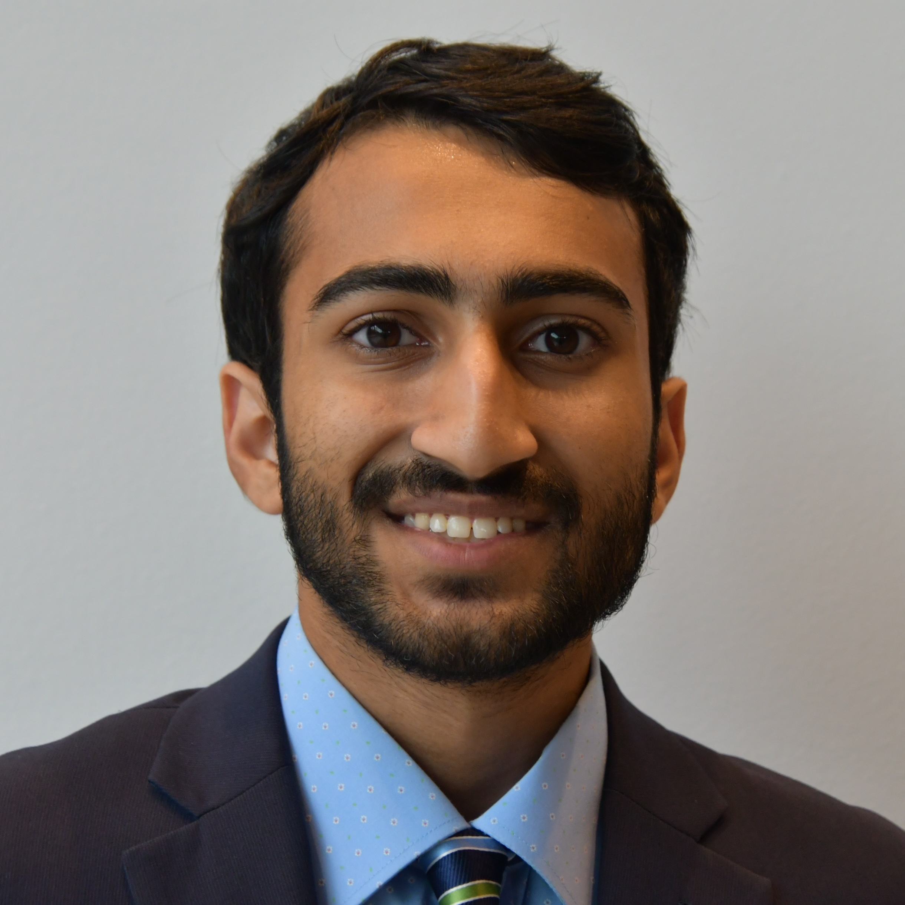

Team
============

#### Principal investigator

  

    
    <a href="https://aerospace.illinois.edu/directory/profile/fevrard" style="text-decoration:none"><b>Fabien Evrard</b></a>
     <!-- <b><a style="color:#C84113" href="../cv/fevrard.pdf">[CV]</a></b> -->
      
    Assistant Professor   
    Aerospace Engineering   
    <a href="mailto:fevrard@illinois.edu">fevrard@illinois.edu</a>   
    <a href="../cv/fevrard.pdf"><i class="ai ai-cv-square ai-2x"></i></a>
    <a href="https://scholar.google.com/citations?user=94-2c98AAAAJ&hl=en"><i class="ai ai-google-scholar-square ai-2x"></i></a>
    <a href="https://www.researchgate.net/profile/Fabien-Evrard"><i class="ai ai-researchgate-square ai-2x"></i></a>
    <a href="https://github.com/fabienevrard"><i class="fab fa-github-square fa-2x"></i></a>
    <a href="https://arxiv.org/search/?searchtype=author&query=Evrard%2C+F"><i class="ai ai-arxiv-square ai-2x"></i></a>
  

  

  

  

  

#### Graduate students

  

    
    <a href="." style="text-decoration:none"><b>Lorenzo Bruni</b></a> 
    Ph.D. Student   
    Aerospace Engineering   
    <a href="mailto:lbruni2@illinois.edu">lbruni2@illinois.edu</a>    
    Co-advised by   <a href="https://aerospace.illinois.edu/directory/profile/lvillafa" style="text-decoration:none">Prof. Laura Villafañe</a>
  

  

    
    <a href="." style="text-decoration:none"><b>Conrad Delgado</b></a> 
    Ph.D. Student  
    Aerospace Engineering   
    <a href="mailto:conradd3@illinois.edu">conradd3@illinois.edu</a>    
    Co-advised by  <a href="https://aerospace.illinois.edu/directory/profile/mpanesi" style="text-decoration:none">Prof. Marco Panesi</a>    
  

  

    
    <a href="." style="text-decoration:none"><b>Ilia Kheirkhah</b></a> 
    Ph.D. Student   
    Aerospace Engineering   
    <a href="mailto:iliak2@illinois.edu">iliak2@illinois.edu</a>   
  

  

    
    <a href="." style="text-decoration:none"><b>Parin Trivedi</b></a> 
    Ph.D. Student   
    Aerospace Engineering   
    <a href="mailto:parinht2@illinois.edu">parinht2@illinois.edu</a>   
  

#### Undergraduate students

   

    
    <a href="." style="text-decoration:none"><b>Ashish Dhanalakota</b></a> 
    B.S. Student   
    Aerospace Engineering   
    <a href="mailto:ashishd4@illinois.edu">ashishd4@illinois.edu</a>
  

   

    
    <a href="." style="text-decoration:none"><b>Richie Ma</b></a> 
    B.S. Student   
    Aerospace Engineering   
    <a href="mailto:student1@illinois.edu">richiem2@illinois.edu</a>
  

  

    
    <a href="." style="text-decoration:none"><b>Sid Sudhir</b></a> 
    B.S. Student   
    Aerospace Engineering   
    <a href="mailto:sudhir3@illinois.edu">sudhir3@illinois.edu</a>
  

<!-- #### Visitors -->

<!-- 

   

    
    <a href="." style="text-decoration:none"><b>Valentin Wasquel</b></a> 
    M.S. Student   
    Aerospace Engineering (ISAE-Supaéro) & Applied Mathematics (Université Toulouse III) 
    <a href="mailto:vwasquel@illinois.edu">vwasquel@illinois.edu</a>
  

   <!-- 

    
    <a href="." style="text-decoration:none"><b>Aryan Shah</b></a> 
    B.S. Student   
    Aerospace Engineering   
    <a href="mailto:student1@illinois.edu">aryanvs2@illinois.edu</a>
  

  

    
    <a href="." style="text-decoration:none"><b>Sid Sudhir</b></a> 
    B.S. Student   
    Aerospace Engineering   
    <a href="mailto:sudhir3@illinois.edu">sudhir3@illinois.edu</a>
  

 -->

#### Alumni
<small>_Names of former students are followed by their last known position._ </small>
Valentin Wasquel (Visiting Student, 2025) -- PhD student at CEA, France. 
Aryan Shah (Undergraduate Research, 2025) -- Junior at UIUC. 
Kanishka Deepak (M.Sc. Thesis, 2024) -- Project engineer at OneH2. 
Richeek Dutta (Undergraduate Research, 2024) -- Graduate student at Georgia Tech.

  <!-- 

    
    <a href="."><b>Kanishka Deepak</b></a> 
    M.S. Student   
    Aerospace Engineering   
    <a href="mailto:kdeepak2@illinois.edu">kdeepak2@illinois.edu</a>
  
 -->
   <!-- 

    
    <a href="."><b>Richeek Dutta</b></a> 
    B.S. Student   
    Aerospace Engineering   
    <a href="mailto:student1@illinois.edu">richeek2@illinois.edu</a>
  
 -->
